# Insurance Claim Management System
### A SQL-Based Relational Database for End-to-End Insurance Claim Processing

<p>
  
  
  
  
  
</p>

<p><i>A comprehensive relational database system that manages insurance claims from First Notice of Loss (FNOL) through to final financial settlement.</i></p>
</div>

---


## Project Overview

The **Insurance Claim Management System (CMS)** is a sophisticated relational database solution designed to optimize how insurance companies manage their claims. It eliminates data silos by consolidating claim, policy, exposure, and financial data into a single unified database — maintaining both efficiency and integrity at scale.

**The system covers the full claim lifecycle:**

```
FNOL (First Notice of Loss)  ──►  Claim Registration  ──►  Exposure Assessment
                                                                    │
                                                        Policy Coverage Verification
                                                                    │
                                                        Financial Processing & Settlement
```

> **Key capability:** Role-based access control, full audit trail via the History table, and automated payment constraint enforcement ensure accountability at every stage.

---

## System Architecture
The system is built around **12 interconnected tables** that handle every aspect of the claim process:

| Layer | Tables | Purpose |
|-------|--------|---------|
| **Claim Core** | `Claim`, `FNOL` | Claim registration and first notice of loss |
| **Policy** | `Policy`, `PolicyCoverage`, `CoveredPeople`, `Vehicle` | Policy and coverage verification |
| **Loss** | `LossType`, `LossState` | Loss classification and location |
| **Operations** | `Exposure`, `Financial` | Exposure tracking and payment processing |
| **Audit** | `History`, `Employer` | Employee activity and audit logging |

---

## Database Schema

### Claim Table
Stores all insurance claim records, linking to policy, exposure, history, and FNOL.

```sql
CREATE TABLE Claim (
    claim_Number    VARCHAR(30) PRIMARY KEY,
    policy_id       VARCHAR(30),
    history_id      VARCHAR(30),
    exposure_id     VARCHAR(30),
    FNOL_ID         VARCHAR(30),
    claimant_Fname  VARCHAR(255),
    claimant_Lname  VARCHAR(255),
    claim_State     VARCHAR(10),
    FOREIGN KEY (policy_id)    REFERENCES Policy(policy_id)     ON DELETE CASCADE,
    FOREIGN KEY (history_id)   REFERENCES History(history_id)   ON DELETE CASCADE,
    FOREIGN KEY (exposure_id)  REFERENCES Exposure(exposure_id) ON DELETE CASCADE,
    FOREIGN KEY (FNOL_ID)      REFERENCES FNOL(FNOL_ID)         ON DELETE CASCADE
);
```

### Policy Table
Holds all insurance policy details and links to coverage, people, and vehicles.

```sql
CREATE TABLE Policy (
    policy_id           VARCHAR(30) PRIMARY KEY,
    policyNumber        VARCHAR(30),
    active              VARCHAR(10),
    policyHolderName    VARCHAR(255),
    policyCoverage_id   VARCHAR(30),
    coveredPeople_id    VARCHAR(30),
    vehicle_id          VARCHAR(30),
    FOREIGN KEY (policyCoverage_id) REFERENCES PolicyCoverage(policyCoverage_id) ON DELETE CASCADE,
    FOREIGN KEY (coveredPeople_id)  REFERENCES CoveredPeople(coveredPeople_id)   ON DELETE CASCADE,
    FOREIGN KEY (vehicle_id)        REFERENCES VehicleDetails(vehicle_id)        ON DELETE CASCADE
);
```

### PolicyCoverage Table
Defines coverage types and monetary limits per policy.

```sql
CREATE TABLE PolicyCoverage (
    policyCoverage_id   VARCHAR(30) PRIMARY KEY,
    coverageName        VARCHAR(30),
    coveredAmount       FLOAT NOT NULL,
    deductible          FLOAT
);
```

### CoveredPeople Table
Tracks all individuals covered under a policy.

```sql
CREATE TABLE CoveredPeople (
    coveredPeople_id    VARCHAR(30) PRIMARY KEY,
    firstName           VARCHAR(255),
    lastName            VARCHAR(255),
    relation            VARCHAR(255)
);
```

### VehicleDetails Table
Records vehicle information tied to automotive policies.

```sql
CREATE TABLE VehicleDetails (
    vehicle_id          VARCHAR(30) PRIMARY KEY,
    vehicleName         VARCHAR(30),
    model               VARCHAR(20),
    yearManufactured    DATE,
    color               VARCHAR(20)
);
```

### History Table
Full audit trail of all create, edit, and delete actions on claims.

```sql
CREATE TABLE History (
    history_id      VARCHAR(30) PRIMARY KEY,
    employee_id     VARCHAR(30),
    created         DATE,
    edited          DATE,
    deleted         DATE,
    FOREIGN KEY (employee_id) REFERENCES Employer(employee_id) ON DELETE CASCADE
);
```

### Employer Table
Stores employee data with unique constraints on contact information.

```sql
CREATE TABLE Employer (
    employee_id     VARCHAR(30) PRIMARY KEY,
    firstName       VARCHAR(255),
    lastName        VARCHAR(255),
    email           VARCHAR(255),
    phoneNumber     INT,
    UNIQUE KEY (email),
    UNIQUE KEY (phoneNumber)
);
```

### Exposure Table
Tracks individual risks or losses associated with a claim.

```sql
CREATE TABLE Exposure (
    exposure_id         VARCHAR(30) PRIMARY KEY,
    exposureName        VARCHAR(255),
    policyCoverage_id   VARCHAR(30),
    FNOL_id             VARCHAR(30),
    financials_id       VARCHAR(30),
    exposureState       VARCHAR(10),
    FOREIGN KEY (policyCoverage_id) REFERENCES PolicyCoverage(policyCoverage_id) ON DELETE CASCADE,
    FOREIGN KEY (FNOL_id)           REFERENCES FNOL(FNOL_id)                     ON DELETE CASCADE,
    FOREIGN KEY (financials_id)     REFERENCES Financial(financial_id)           ON DELETE CASCADE
);
```

### FNOL Table
Records the first notice of loss — the initial incident report.

```sql
CREATE TABLE FNOL (
    FNOL_id         VARCHAR(30) PRIMARY KEY,
    lossType_id     VARCHAR(30),
    lossCause       VARCHAR(255),
    severity        VARCHAR(10),
    FOREIGN KEY (lossType_id) REFERENCES LossType(lossType_id) ON DELETE CASCADE
);
```

### Financial Table
Manages all payment records associated with claim exposures.

```sql
CREATE TABLE Financial (
    financial_id        VARCHAR(30) PRIMARY KEY,
    paymentType         VARCHAR(255),
    paymentAmmount      FLOAT NOT NULL,
    paymentStatus       VARCHAR(10),
    deductibleApplied   FLOAT
);
```

### LossType Table
Categorizes types of losses for classification and reporting.

```sql
CREATE TABLE LossType (
    lossType_id     VARCHAR(30) PRIMARY KEY,
    lossTypeName    VARCHAR(255),
    lossCategory    VARCHAR(255)
);
```

### LossState Table
Maps state codes to state names for geographic loss tracking.

```sql
CREATE TABLE LossState (
    StateCode   VARCHAR(5) PRIMARY KEY,
    StateName   VARCHAR(40)
);
```

---

## 🔗 Entity Relationship Diagram
<p align="center">
  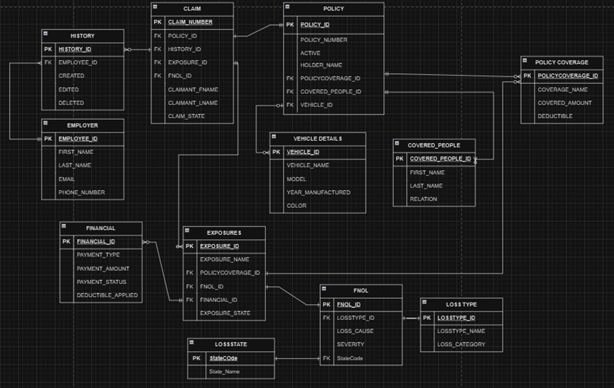
  <br/>
  <em>Entity Relationship Diagram (ERD) for the Insurance Claim Management System</em>
</p>

---

## Table Relationships

| Relationship | Type |
|--------------|------|
| `Employer` ↔ `History` | One to Many (1:M) |
| `Claim` ↔ `History` | One to Many (1:M) |
| `Claim` ↔ `Policy` | One to One (1:1) |
| `Claim` ↔ `Exposure` | One to Many (1:M) |
| `Policy` ↔ `PolicyCoverage` | One to Many (1:M) |
| `Policy` ↔ `VehicleDetails` | One to Many (1:M) |
| `Policy` ↔ `CoveredPeople` | One to Many (1:M) |
| `Exposure` ↔ `PolicyCoverage` | One to Many (1:M) |
| `Exposure` ↔ `Financial` | One to Many (1:M) |
| `Exposure` ↔ `FNOL` | One to One (1:1) |
| `FNOL` ↔ `LossState` | One to One (1:1) |
| `FNOL` ↔ `LossType` | One to One (1:1) |

---

## Data Dictionary

Each table's columns, types, and descriptions are listed below.

### Claim

| Column | Type | Description |
|--------|------|-------------|
| `claim_Number` | VARCHAR(30) | **PK** — Unique claim identifier |
| `policy_id` | VARCHAR(30) | **FK** → Policy |
| `history_id` | VARCHAR(30) | **FK** → History |
| `exposure_id` | VARCHAR(30) | **FK** → Exposure |
| `FNOL_ID` | VARCHAR(30) | **FK** → FNOL |
| `claimant_Fname` | VARCHAR(255) | Claimant first name |
| `claimant_Lname` | VARCHAR(255) | Claimant last name |
| `claim_State` | VARCHAR(10) | Status: `ACTIVE` / `INACTIVE` |

### Policy

| Column | Type | Description |
|--------|------|-------------|
| `policy_id` | VARCHAR(30) | **PK** — Unique policy identifier |
| `policyNumber` | VARCHAR(30) | Policy reference number |
| `active` | VARCHAR(10) | `1` = Active, `0` = Inactive |
| `policyHolderName` | VARCHAR(255) | Full name of policyholder |
| `policyCoverage_id` | VARCHAR(30) | **FK** → PolicyCoverage |
| `coveredPeople_id` | VARCHAR(30) | **FK** → CoveredPeople |
| `vehicle_id` | VARCHAR(30) | **FK** → VehicleDetails |

### PolicyCoverage

| Column | Type | Description |
|--------|------|-------------|
| `policyCoverage_id` | VARCHAR(30) | **PK** — Unique coverage identifier |
| `coverageName` | VARCHAR(30) | Coverage type (e.g., Collision, Liability) |
| `coveredAmount` | FLOAT | Maximum covered amount |
| `deductible` | FLOAT | Applicable deductible amount |

### CoveredPeople

| Column | Type | Description |
|--------|------|-------------|
| `coveredPeople_id` | VARCHAR(30) | **PK** — Unique identifier |
| `firstName` | VARCHAR(255) | First name |
| `lastName` | VARCHAR(255) | Last name |
| `relation` | VARCHAR(255) | Relation to policyholder (e.g., Spouse, Dependent) |

### VehicleDetails

| Column | Type | Description |
|--------|------|-------------|
| `vehicle_id` | VARCHAR(30) | **PK** — Unique vehicle identifier |
| `vehicleName` | VARCHAR(30) | Vehicle make/name |
| `model` | VARCHAR(20) | Vehicle model |
| `yearManufactured` | DATE | Year of manufacture |
| `color` | VARCHAR(20) | Vehicle color |

### History

| Column | Type | Description |
|--------|------|-------------|
| `history_id` | VARCHAR(30) | **PK** — Unique history record |
| `employee_id` | VARCHAR(30) | **FK** → Employer |
| `created` | DATE | Date record was created |
| `edited` | DATE | Date record was last edited |
| `deleted` | DATE | Date record was deleted |

### Employer

| Column | Type | Description |
|--------|------|-------------|
| `employee_id` | VARCHAR(30) | **PK** — Unique employee identifier |
| `firstName` | VARCHAR(255) | First name |
| `lastName` | VARCHAR(255) | Last name |
| `email` | VARCHAR(255) | Email address (unique) |
| `phoneNumber` | INT | Phone number (unique) |

### Exposure

| Column | Type | Description |
|--------|------|-------------|
| `exposure_id` | VARCHAR(30) | **PK** — Unique exposure identifier |
| `exposureName` | VARCHAR(255) | Name/description of exposure |
| `policyCoverage_id` | VARCHAR(30) | **FK** → PolicyCoverage |
| `FNOL_id` | VARCHAR(30) | **FK** → FNOL |
| `financials_id` | VARCHAR(30) | **FK** → Financial |
| `exposureState` | VARCHAR(10) | Current state of exposure |

### FNOL

| Column | Type | Description |
|--------|------|-------------|
| `FNOL_id` | VARCHAR(30) | **PK** — Unique FNOL identifier |
| `lossType_id` | VARCHAR(30) | **FK** → LossType |
| `lossCause` | VARCHAR(255) | Cause of the loss |
| `severity` | VARCHAR(10) | Severity: `LOW` / `MEDIUM` / `HIGH` |

### Financial

| Column | Type | Description |
|--------|------|-------------|
| `financial_id` | VARCHAR(30) | **PK** — Unique financial record |
| `paymentType` | VARCHAR(255) | Payment method (e.g., Cash, Card, Check) |
| `paymentAmmount` | FLOAT | Payment amount |
| `paymentStatus` | VARCHAR(10) | Status: `Paid` / `Unpaid` / `Pending` |
| `deductibleApplied` | FLOAT | Deductible amount applied |

### LossType

| Column | Type | Description |
|--------|------|-------------|
| `lossType_id` | VARCHAR(30) | **PK** — Unique loss type identifier |
| `lossTypeName` | VARCHAR(255) | Name of the loss type |
| `lossCategory` | VARCHAR(255) | Category of loss |

### LossState

| Column | Type | Description |
|--------|------|-------------|
| `StateCode` | VARCHAR(5) | **PK** — State abbreviation (e.g., `CA`, `NY`) |
| `StateName` | VARCHAR(40) | Full state name |

---

## SQL Analysis Queries

Ten analytical queries were developed to extract business insights from the database.

### Analysis 1 — Total Claims per Policy
Identifies claim patterns to reassess policy premiums.

```sql
SELECT p.policy_id, COUNT(c.policy_id) AS claim_count
FROM policy p
LEFT JOIN claim c ON p.policy_id = c.policy_id
GROUP BY p.policy_id
LIMIT 0, 1000;
```
<p align="center">
  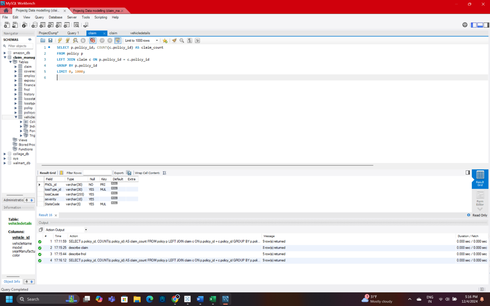
</p>

---

### Analysis 2 — Top Claim-Processing Employees
Evaluates employee performance for recognition and workload balancing.

```sql
SELECT e.employee_id, e.firstName, e.lastName,
       COUNT(c.history_id) AS claims_processed
FROM employer e
JOIN history h ON e.employee_id = h.employee_id
JOIN claim c   ON h.history_id  = c.history_id
GROUP BY e.employee_id
ORDER BY claims_processed DESC
LIMIT 5;
```
<p align="center">
  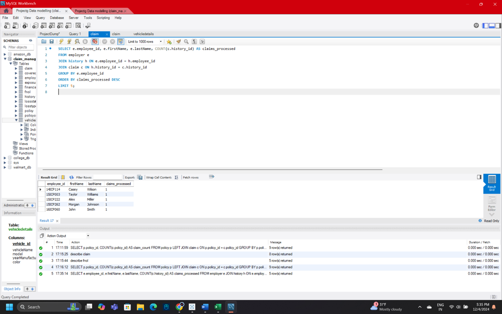
</p>

---


### Analysis 3 — Claims with Missing Exposure Details
Identifies data entry gaps for quality control.

```sql
SELECT c.claim_Number, c.policy_id, c.exposure_id
FROM claim c
LEFT JOIN exposure e ON c.exposure_id = e.exposure_id
WHERE e.exposure_id IS NULL;
```
<p align="center">
  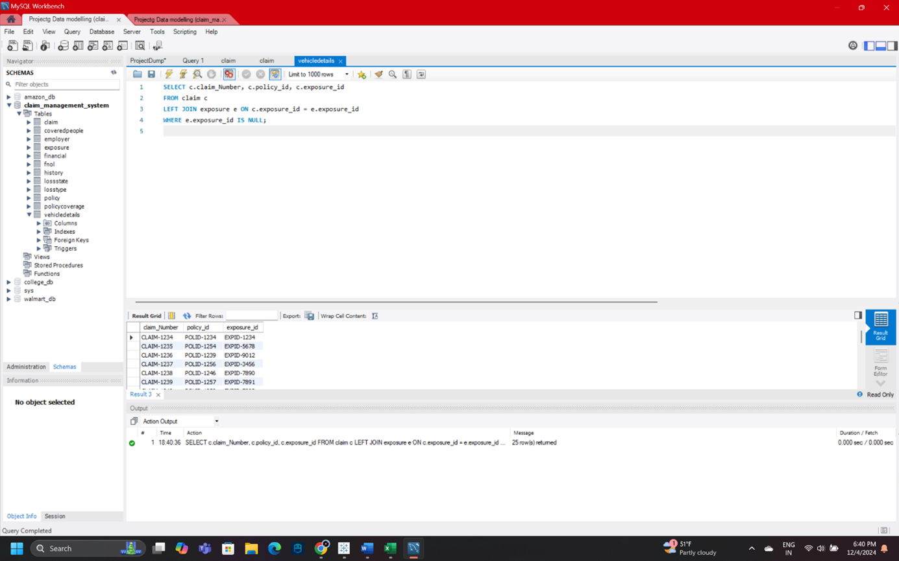
</p>

---


### Analysis 4 — Claim Distribution by Severity
Analyses how claims are distributed across severity levels.

```sql
SELECT f.severity, COUNT(c.claim_Number) AS claim_count
FROM fnol f
JOIN claim c ON f.FNOL_id = c.FNOL_ID
GROUP BY f.severity
ORDER BY claim_count DESC;
```

<p align="center">
  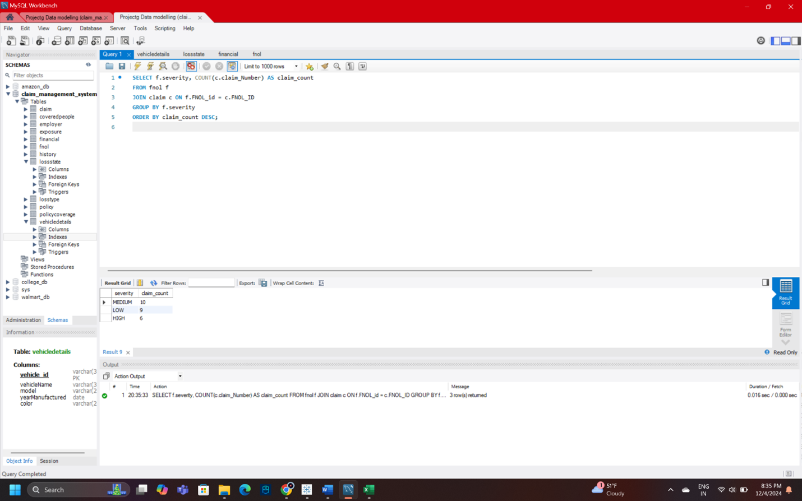
</p>

---

### Analysis 5 — Active Policies with Associated Claims
Displays active policies ordered by claim volume.

```sql
SELECT p.policyNumber, p.policyHolderName,
       COUNT(c.claim_Number) AS claim_count
FROM policy p
LEFT JOIN claim c ON p.policy_id = c.policy_id
WHERE p.active = 1
GROUP BY p.policyNumber, p.policyHolderName
ORDER BY claim_count DESC;
```

<p align="center">
  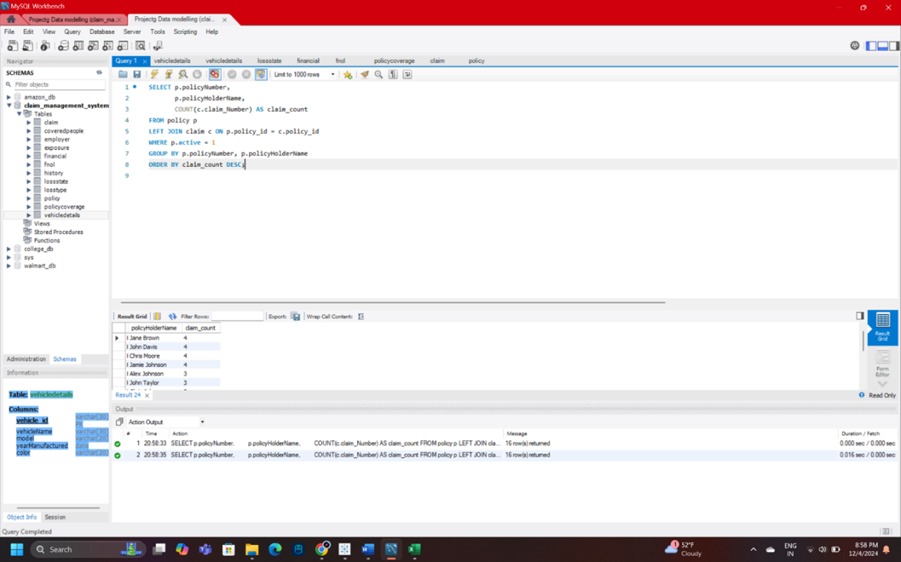
</p>

---

### Analysis 6 — Inactive Policies with Unresolved Claims
Flags inactive policies that still have open claims.

```sql
SELECT p.policy_id, p.policyNumber,
       COUNT(c.claim_Number) AS claim_count
FROM policy p
JOIN claim c ON p.policy_id = c.policy_id
WHERE p.active = 0
GROUP BY p.policy_id, p.policyNumber
ORDER BY claim_count DESC;
```

<p align="center">
  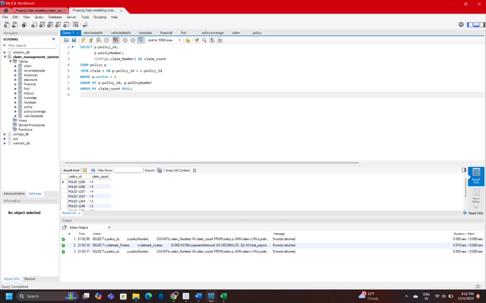
</p>

---

### Analysis 7 — Claims by Specific Policyholders
Retrieves claims and coverage details for targeted policyholders.

```sql
SELECT c.claim_Number, p.policyHolderName,
       c.claimant_Fname, c.claimant_Lname, pc.coveredAmount
FROM claim c
JOIN policy p         ON c.policy_id          = p.policy_id
JOIN policycoverage pc ON p.policyCoverage_id = pc.policyCoverage_id
WHERE p.policyHolderName IN ('John Doe', 'Jane Smith');
```

<p align="center">
  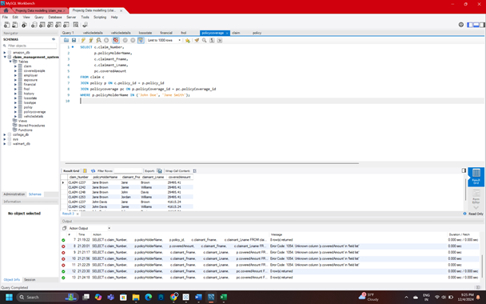
</p>

---

### Analysis 8 — Most Used Payment Types
Identifies the top payment methods used for claim settlements.

```sql
SELECT paymentType, COUNT(financial_id) AS transaction_count
FROM financial
GROUP BY paymentType
ORDER BY transaction_count DESC
LIMIT 5;
```

<p align="center">
  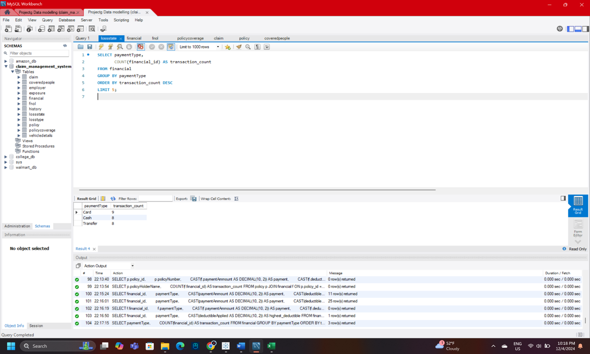
</p>

---

### Analysis 9 — Payment Trends by Status and Type
Examines transaction volume and total amounts by payment status and type.

```sql
SELECT f.paymentStatus, f.paymentType,
       COUNT(f.financial_id)                          AS total_transactions,
       SUM(CAST(f.paymentAmmount AS DECIMAL(10,2)))   AS total_amount
FROM financial f
GROUP BY f.paymentStatus, f.paymentType
ORDER BY f.paymentStatus, total_transactions DESC;
```

<p align="center">
  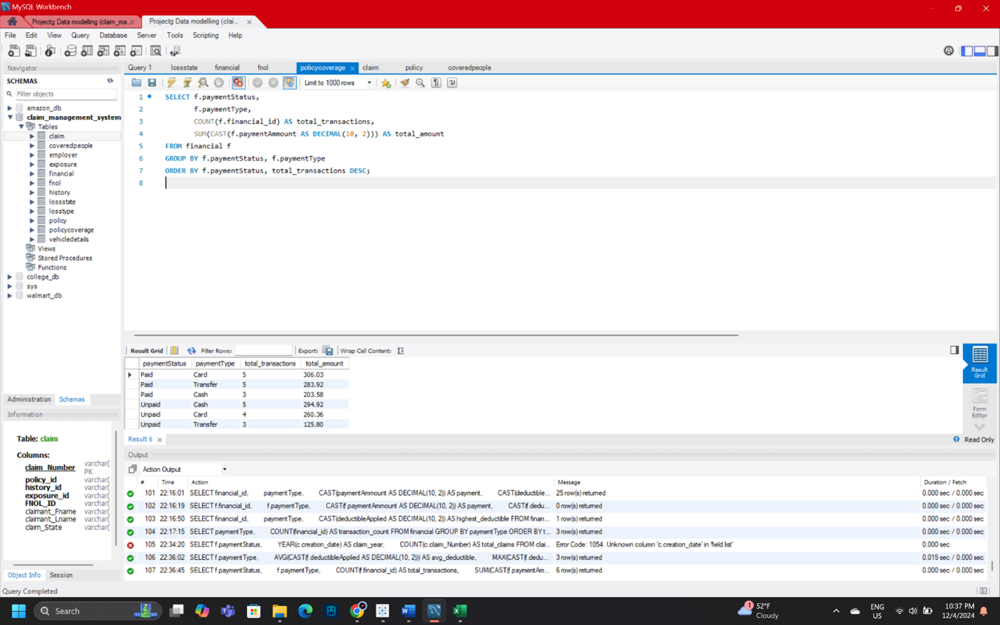
</p>

---

### Analysis 10 — Monthly & Yearly Activity Trends
Tracks claim activity over time for operational reporting.

```sql
SELECT YEAR(created)  AS activity_year,
       MONTH(created) AS activity_month,
       COUNT(history_id) AS total_activities
FROM history
WHERE created IS NOT NULL
GROUP BY activity_year, activity_month
ORDER BY activity_year DESC, activity_month DESC;
```

<p align="center">
  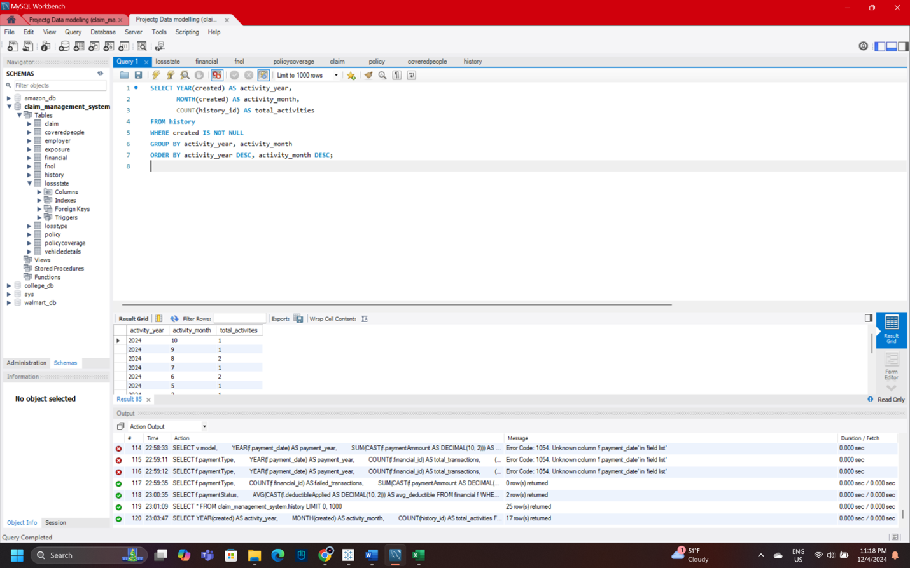
</p>

---

## 📋 Business Rules

| Rule | Description |
|------|-------------|
| **Unique Claims** | Each claim has a distinct claim number for tracking |
| **Active Policy Required** | Claims can only be filed under an active policy |
| **Mandatory Claim Info** | Policy number, claim amount, and incident date are required |
| **Coverage Verification** | Each claim must be verified against policy coverage before processing |
| **Claim Status Tracking** | Status flows: `Pending` → `In Review` → `Approved` / `Rejected` |
| **Role-Based Access** | Access is controlled by employee role |
| **Audit Logging** | All create, edit, and delete actions are logged in the History table |
| **No Duplicate Claims** | System prevents duplicate claims for the same incident |
| **Payment Authorization** | Payments require designated staff approval before disbursement |
| **Payment Constraints** | Compensation amount must not exceed the covered amount |

---

<div align="center">
  <sub>INFO 5707.401 — Data Modelling for Information Professionals | University of North Texas</sub>
</div>

